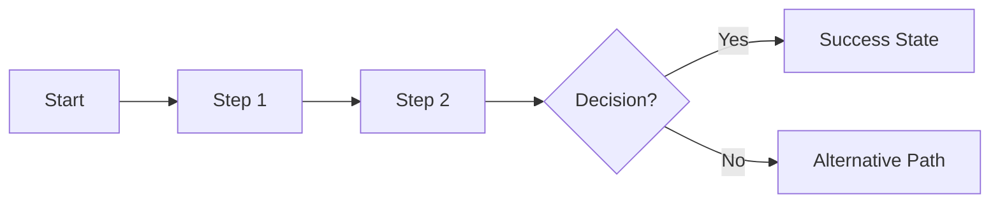
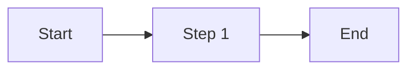

# {Website Name} — Information Architecture
> Version: 1.0 | Date: {YYYY-MM-DD} | Status: Draft

---

## 1. Project Overview

### 1.1 Website Goal
{One paragraph describing what this website is for and what success looks like.}

### 1.2 Target Users
| User Type | Description | Primary Goal on Site |
|---|---|---|
| {Type 1} | {Brief description} | {What they want to do} |
| {Type 2} | {Brief description} | {What they want to do} |

### 1.3 Primary User Action (North Star)
> {The single most important thing a user should do on this site, e.g., "Sign up for a free trial"}

### 1.4 Design Principles
- {Principle 1, e.g., "Mobile-first — majority of users come from mobile"}
- {Principle 2}
- {Principle 3}

---

## 2. Sitemap

{Insert Mermaid sitemap diagram generated by sitemap-skill}

### Page Index
| ID | Page | Level | Auth Required | Notes |
|---|---|---|---|---|
| A | {Page Name} | L1 | No / Yes | {Notes} |

---

## 3. User Flows

### Flow 1: {Flow Name}
> **Trigger**: {What initiates this flow, e.g., "User clicks 'Get Started' on homepage"}
> **Goal**: {What the user is trying to accomplish}
> **Success state**: {What happens when they succeed}

---

### Flow 2: {Flow Name}
> **Trigger**: {What initiates this flow}
> **Goal**: {What the user is trying to accomplish}
> **Success state**: {What happens when they succeed}

---

## 4. Key Page Wireframes

> These wireframes cover the highest-priority pages identified during planning.
>
> **Notation guide**:
> `[ Label ]` → Button / CTA
> `{ Label }` → Text / Heading / Copy
> `( placeholder )` → Input field
> `~~~ Label ~~~` → Image / Media placeholder
> `«Label»` → Badge / Tag
> `▼ Label` → Dropdown

---

{Insert wireframe blocks from wireframe-skill — one subsection per page}

---

## 5. Content & Feature Inventory

| Page | Content Blocks | Key Features / Interactions |
|---|---|---|
| {Page Name} | {e.g., Hero, Features Grid, Testimonials, CTA} | {e.g., Sticky nav, video autoplay, filtered search} |
| {Page Name} | | |

---

## 6. Next Steps & Recommendations

### For the Design Team
- {Recommendation, e.g., "Prioritize high-fidelity mockups for Homepage and Pricing page first"}
- {Recommendation}
- {Recommendation}

### For the Development Team
- {Recommendation, e.g., "Auth flow needed — plan for session management and protected routes"}
- {Recommendation}

### Open Questions
- [ ] {Unresolved design decision from the conversation}
- [ ] {Content gap that needs client input}
- [ ] {Technical dependency requiring clarification}

---

*Document generated with ia-conversation-skill + sitemap-skill + wireframe-skill + ia-document-skill*
