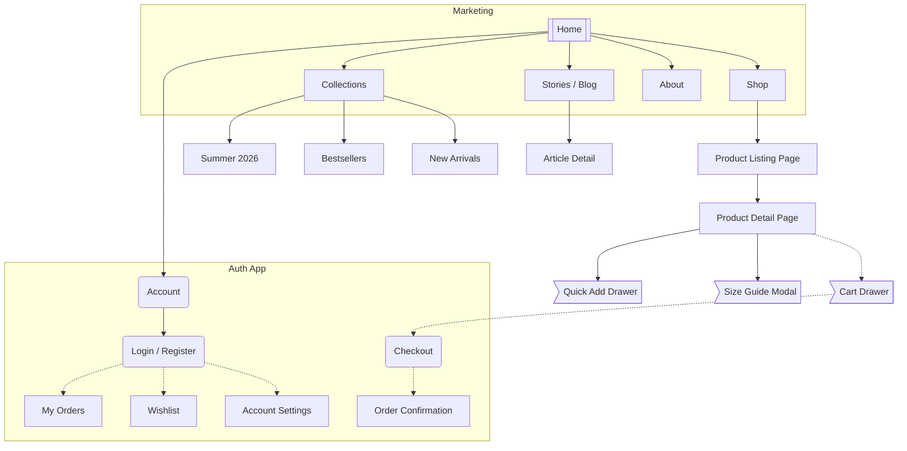

# Sitemap Example — E-commerce Fashion Store

> This is a reference example showing the expected output format of `sitemap-skill`.

---

## Sitemap

> Legend:
> `[[...]]` Home / Root page
> `[...]` Standard page
> `(...)` Auth / Login page
> `>...]` Modal or Drawer
> `{{...}}` External link

### Page Index

| ID | Page Name | Level | Auth Required | Notes |
|---|---|---|---|---|
| A | Home | L1 | No | Main landing page |
| B | Shop | L1 | No | Top-level category gateway |
| B1 | Product Listing Page | L2 | No | Filterable grid |
| B2 | Product Detail Page | L3 | No | Core conversion page |
| B3 | Quick Add Drawer | L3 | No | Overlay, stays on PDP |
| B4 | Size Guide Modal | L3 | No | Overlay |
| C | Collections | L1 | No | Curated groupings |
| C1 | Summer 2026 | L2 | No | Seasonal collection |
| C2 | Bestsellers | L2 | No | |
| C3 | New Arrivals | L2 | No | |
| D | Stories / Blog | L1 | No | Content marketing |
| D1 | Article Detail | L2 | No | |
| E | Account | L1 | No | Hub page, prompts login |
| E2 | Login / Register | L2 | No | Combined auth page |
| E3 | My Orders | L2 | Yes | |
| E4 | Wishlist | L2 | Yes | |
| E5 | Account Settings | L2 | Yes | |
| G | Cart Drawer | — | No | Global overlay |
| H | Checkout | — | No | Guest or logged-in |
| I | Order Confirmation | — | No | Post-purchase |
