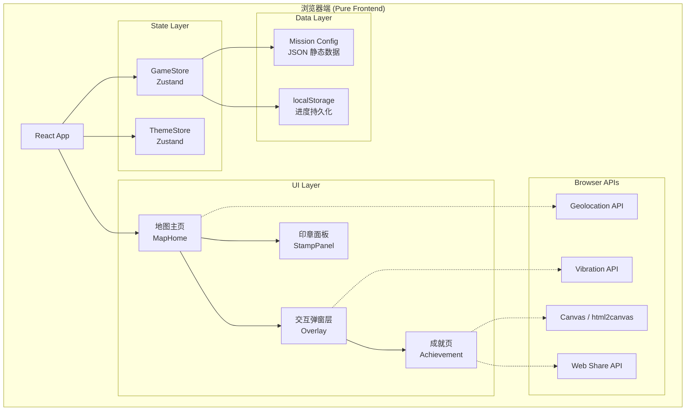
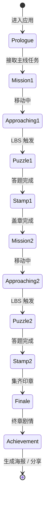
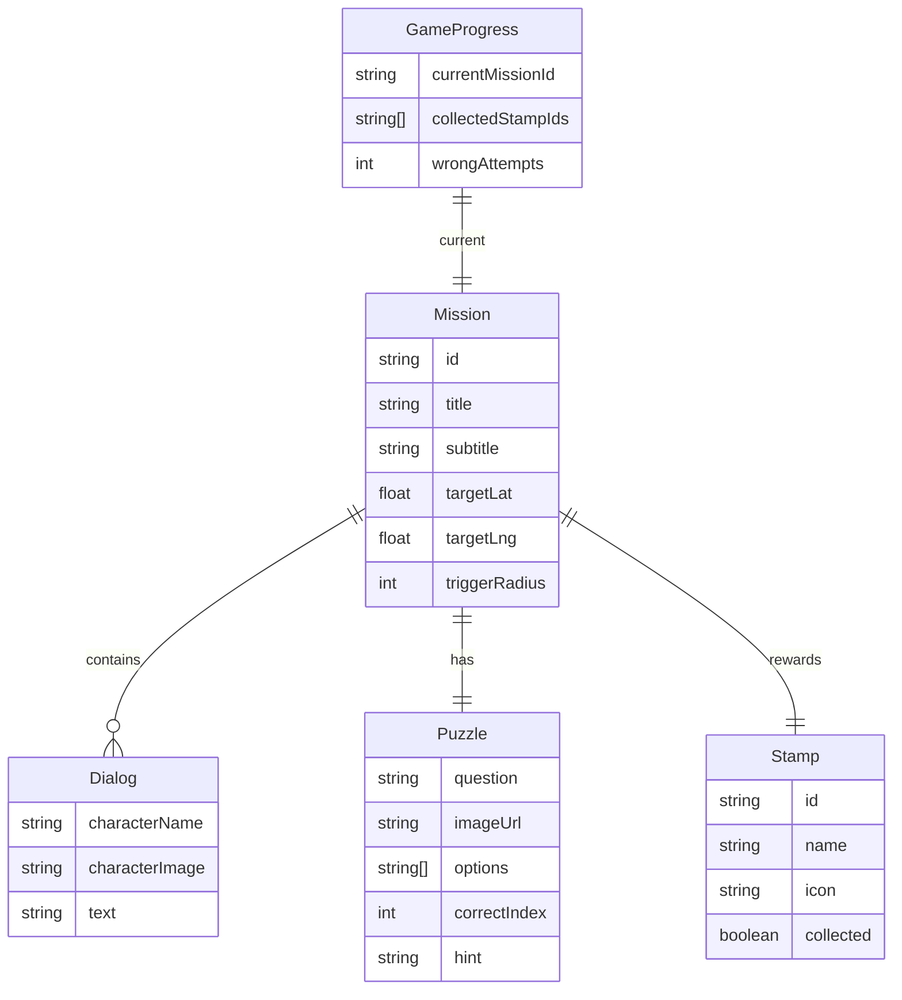

# 技术选型文档 / Tech Stack Decision

## 项目概述 / Project Overview

**西递秘档：明经遗梦** — 面向移动端的轻量级游戏化叙事 Web 应用。玩家在西递古村落实地探索，通过 GPS 定位触发剧情与解谜任务，收集印章，最终生成成就海报。

MVP 为黑客松演示目的，采用纯前端架构，无后端依赖。所有游戏数据静态硬编码，玩家进度存储于浏览器本地。

## 需求分析 / Requirements Analysis

| 维度 | 结论 | 影响 |
|---|---|---|
| 业务领域 | 文旅 + 游戏化叙事，实景解谜 | 无复杂业务逻辑，状态机驱动 |
| 用户规模 | 黑客松 MVP，极低 DAU | 无需考虑性能优化和高并发 |
| 数据复杂度 | 3 个固定关卡，3 枚印章 | 无数据库，JSON 静态配置即可 |
| 集成需求 | GPS 定位、Canvas 海报、Web Share | 浏览器原生 API 可满足 |
| 实时需求 | 无 | 不需要 WebSocket |
| 安全合规 | 极低，无用户账号 | 无需认证系统 |
| 部署约束 | 移动端浏览器演示 | 静态托管即可（Vercel / GitHub Pages） |

## 技术栈决策 / Stack Decisions

### Frontend: React 18 + TypeScript + Vite

| 选择 | 理由 |
|---|---|
| **React 18** | 组件化开发适合游戏 UI 的多层覆盖结构（地图 → 弹窗 → 剧情 → 解谜）；Concurrent Mode 有助于动画流畅性 |
| **TypeScript** | 游戏状态类型安全，关卡数据结构清晰定义，防止状态机错误 |
| **Vite** | 最快的开发服务器和 HMR，黑客松争分夺秒 |

### Styling: Tailwind CSS + Custom CSS

| 选择 | 理由 |
|---|---|
| **Tailwind CSS** | 布局、间距、响应式工具类快速开发 |
| **Custom CSS** | 视觉方案要求极端定制（流体模糊背景、荧光线框、backdrop-filter、Glitch 动画），这些无法用 utility class 表达，放 `src/ui/styles/` |

### State Management: Zustand

| 选择 | 理由 |
|---|---|
| **Zustand** | 游戏状态简单（当前关卡、收集的印章、日夜模式），Zustand 最小样板代码；无需 TanStack Query（无服务端数据） |

关键 Store：
- `useGameStore` — 关卡进度、印章收集、答题状态
- `useThemeStore` — 日/夜模式切换（基于物理时钟）

### Animation: Framer Motion

| 选择 | 理由 |
|---|---|
| **Framer Motion** | 视觉方案要求多种复杂动效（盖章动画、弹窗进出、Glitch 闪烁、呼吸效果）；Framer Motion 的 `variants` + `AnimatePresence` 最适合游戏 UI 状态转换 |

### Geolocation: Browser Geolocation API

| 选择 | 理由 |
|---|---|
| **navigator.geolocation** | 浏览器原生 API，`watchPosition` 持续监听位置，满足 LBS 触发需求；无需第三方地图 SDK |

### Poster Generation: html2canvas

| 选择 | 理由 |
|---|---|
| **html2canvas** | 将成就海报 DOM 截图生成图片，支持保存和分享；轻量且不依赖服务端 |

### Sharing: Web Share API + Fallback

| 选择 | 理由 |
|---|---|
| **navigator.share** | 原生分享 API，移动浏览器支持良好 |
| **Fallback** | 不支持时降级为长按保存图片 |

### 不使用的技术（及理由）

| 技术 | 理由 |
|---|---|
| React Router | 单页应用，所有状态在同一页面内切换，路由由状态驱动 |
| shadcn/ui | 视觉方案完全自定义，无标准组件可复用 |
| 后端 (FastAPI 等) | MVP 纯前端，无服务端逻辑 |
| 数据库 | 游戏数据静态，进度存 localStorage |
| Docker | 静态站点无需容器化 |

## 架构图 / Architecture



## 游戏状态机 / Game State Machine



## 数据结构概览 / Data Overview



## API 设计概览 / API Overview

无后端 API。所有数据通过以下方式获取：

| 数据类型 | 来源 |
|---|---|
| 关卡配置（坐标、对话、谜题） | `src/config/missions.ts` 静态导入 |
| 玩家进度 | Zustand store → 自动同步到 localStorage |
| 地理位置 | `navigator.geolocation.watchPosition()` |
| 日夜主题 | `new Date().getHours()` 实时计算 |

## 部署方案 / Deployment

### 开发环境
```bash
npm install
npm run dev        # Vite dev server on http://localhost:5173
```

### 生产部署
- **Vercel**（推荐）: 连接 Git 仓库，自动构建部署，免费 HTTPS
- **GitHub Pages**: `npm run build` → 静态文件推送
- **本地演示**: `npm run build && npm run preview`

## 开发环境搭建 / Dev Setup

```bash
# 1. 进入项目目录
cd projects/xidi-secret-archive

# 2. 安装依赖
npm install

# 3. 启动开发服务器（手机需同网络访问）
npm run dev -- --host

# 4. 手机浏览器访问 http://<电脑IP>:5173

# 5. 运行测试
npm run test         # Vitest 单元测试
npm run test:e2e     # Playwright E2E 测试
```

### 手机调试提示
- 开发时使用 `--host` 参数暴露局域网 IP
- Chrome DevTools → `chrome://inspect` 可远程调试手机页面
- Geolocation 需 HTTPS 或 localhost；Vercel 部署后自动支持 HTTPS

## 风险与缓解 / Risks & Mitigations

| 风险 | 可能性 | 缓解措施 |
|---|---|---|
| Geolocation 精度不足 | 高 | 设置较大触发半径（20m+），增加手动触发按钮作为 fallback |
| iOS Safari 不支持 backdrop-filter | 低 | 提供优雅降级：用半透明纯色背景替代模糊 |
| Web Share API 兼容性 | 中 | 降级为长按保存图片 + 复制链接 |
| 户外 GPS 信号弱 | 高 | 任务卡增加距离显示，允许到达后手动点击确认 |
| 夜间模式耗电 | 低 | CSS 动画使用 `will-change` 和 GPU 加速，避免持续重绘 |

## 完整依赖清单 / Dependency List

### 生产依赖
| 包名 | 版本 | 用途 |
|---|---|---|
| react | ^18.3.0 | UI 框架 |
| react-dom | ^18.3.0 | DOM 渲染 |
| zustand | ^5.0.0 | 状态管理 |
| framer-motion | ^11.0.0 | 动画引擎 |
| html2canvas | ^1.4.0 | 海报截图生成 |

### 开发依赖
| 包名 | 版本 | 用途 |
|---|---|---|
| typescript | ~5.6.0 | 类型系统 |
| vite | ^6.0.0 | 构建工具 |
| @vitejs/plugin-react | ^4.3.0 | React 支持 |
| tailwindcss | ^3.4.0 | CSS 工具类 |
| postcss | ^8.4.0 | CSS 处理 |
| autoprefixer | ^10.4.0 | 浏览器前缀 |
| vitest | ^2.1.0 | 单元测试 |
| @testing-library/react | ^16.0.0 | 组件测试 |
| @playwright/test | ^1.49.0 | E2E 测试 |
