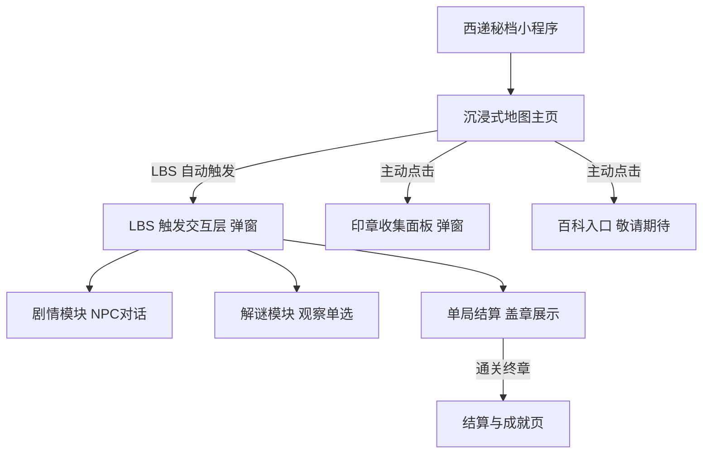
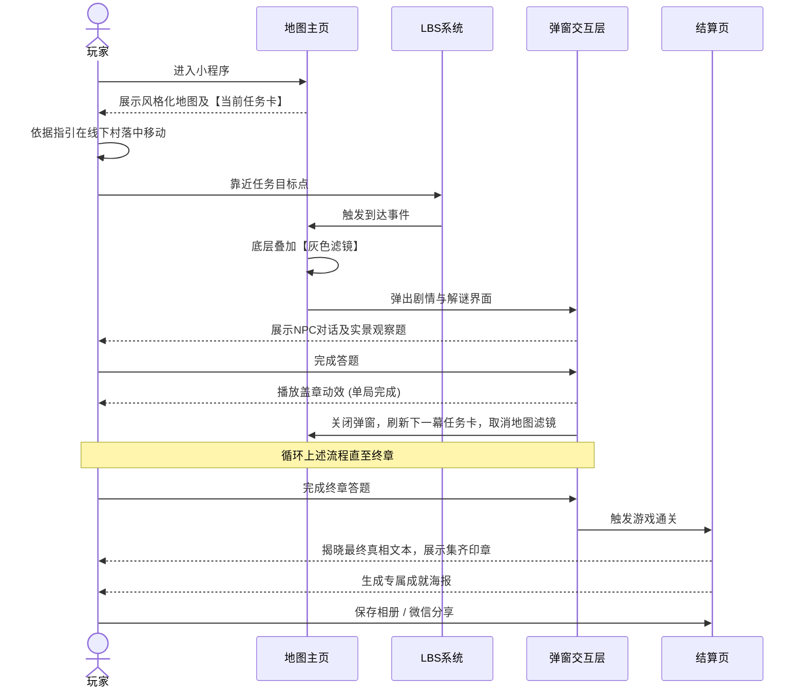

# 站点信息架构 (IA) - 西递秘档：明经遗梦 (MVP版)

## 1. 项目概述 (Project Overview)
- **项目目标**：为西递古村落打造轻量级“游戏化叙事”微信小程序，跑通“任务驱动探索 -> LBS触发 -> 实景解谜打卡”的核心闭环。
- **北极星行动**：玩家跟随地图任务卡片的指引，在线下真实移动至目标地点，通过手机完成实景解谜，并成功收集印章。

## 2. 站点地图 (Sitemap)

## 3. 用户路径流向 (User Flow)

## 4. 核心内容模块清单 (Content Modules)

*注：本清单仅列出极高密度的数据要求与内容元件，不包含任何排版或线框建议，具体视觉与布局交由后续设计环节发挥。*

### 4.1 沉浸式地图主页 (Map Home View)
- **背景层**：全屏风格化地图素材（需支持底层叠加灰色滤镜的状态切换）。
- **任务指引组件**：
  - 任务前置引导文案文本（如“第一幕：寻访牌楼”）。
  - 当前目标地点名称文本。
- **定位与导航组件**：
  - 用户当前位置坐标/图标。
  - 指向目标地点的非精确方向指示器（箭头或光晕）。
- **全局入口组**：
  - **背包/印章入口**：常驻图标按钮（点击触发印章收集面板）。
  - **百科入口**：常驻图标按钮（点击触发 Toast 提示“敬请期待”）。

### 4.2 印章收集面板 (Stamps Panel - 弹窗)
- **面板容器**：覆盖于地图上的悬浮面板（带有半透明/模糊遮罩以区分层级）。
- **核心元件**：
  - 标题文本（如“明经印收集进度”）。
  - **印章槽位组 (共3个)**：
    - 状态A：已点亮（彩色/高亮实心图标素材）。
    - 状态B：未点亮（置灰/线框空心图标素材）。
  - 关闭面板按钮。

### 4.3 LBS 触发交互层 (Interaction Overlay - 弹窗)
- **面板容器**：全屏或半屏弹窗（底层地图须强制打上“灰色滤镜”以聚焦视线）。
- **剧情元件**：
  - NPC 立绘/半身像图片。
  - 角色名称文本。
  - 对话气泡与对话文本。
  - 推进剧情/下一步按钮。
- **解谜元件**：
  - 实物细节观察图片（大图放大局部）。
  - 题目文本（引导玩家观察线下实物）。
  - 单选题选项按钮组（2-4个选项）。
  - 错误反馈提示（文案提示及连续答错高亮正确选项的逻辑样式）。
- **单局结算元件**：
  - 获得印章时的盖章动效占位。
  - “继续探索”确认按钮（点击后关闭弹窗，解除地图滤镜）。

### 4.4 结算与成就页 (Achievement Share Page)
- **内容展示区**：
  - 终章剧情总结段落文本。
  - 三枚印章集齐的组合视觉元素。
- **海报生成组件**：
  - 专为分享设计的复合海报（含底图、成就文案、玩家收集的印章展示、小程序二维码）。
- **行动按钮组 (CTA)**：
  - 保存海报到相册按钮。
  - 分享给好友按钮。
  - 返回地图/重温剧情按钮。
