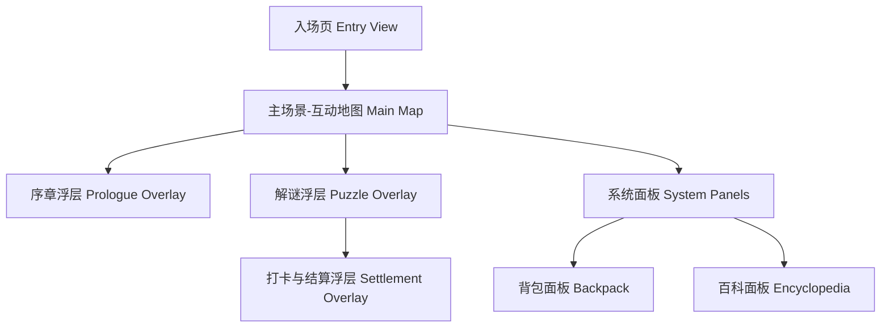
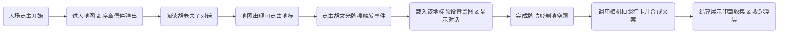

# 西递秘档：明经遗梦 (MVP版) - Information Architecture

**Date**: 2026-04-29
**Status**: Draft
**Version**: 1.0

## 1. 项目概述 (Project Overview)
**目标**：开发一款为西递景区定制的移动端 Web 互动解谜应用（MVP版），起到数字化辅助导游的作用，通过游戏化手段提升游客参与度、游览趣味性和停留时间。
**目标用户**：
- 普通游客：初次到访，需要基础景点背景知识。
- 亲子家庭：寻找互动趣味，降低古建理解门槛。
- 年轻群体：打卡分享，追求成就感。

**北极星行动**：用户顺畅完成核心玩法闭环（主地图探索 -> 移动并点击地标触发解谜 -> 场景问答 -> 拍照打卡 -> 获得印章）。

## 2. 站点地图 (Sitemap)

## 3. 用户流程 (User Flows)

**主核心玩法流 (Core Gameplay Loop)**
- **触发**：用户首次进入游戏
- **目标**：完成序章引导，并在第一个地标点（胡文光牌楼）完成答题打卡
- **成功状态**：获得“仁”字明经印

## 4. 核心页面结构清单 (Key Content Modules)
*(已将线框图转化为高密度文字描述，确保视觉设计发挥最大创意空间)*

### 4.1 入场页 (Entry View)
- **布局定位**：移动端全屏，无边框沉浸式设计。
- **模块结构**：
  1. **全屏背景**：展示西递水墨或赛博古建风格的视觉底图（支持静态或微动效）。
  2. **核心标题组**：居中偏上，包含主标题“西递秘档”及副标题/英文装饰。
  3. **交互触发区**：页面中下方，包含唯一的核心入口按钮“进入西递秘档”。

### 4.2 主场景-互动地图 (Main Map View)
- **布局定位**：全屏可拖拽的二维地图，上方与侧边叠加悬浮 UI 组件。
- **模块结构**：
  1. **常驻挂件**：左上角放置“罗盘”图标；右下角/侧边放置“背包”与“百科”悬浮按钮。
  2. **可交互地图底图**：支持手势拖拽浏览。
  3. **玩家坐标与地标热区**：地图内显示玩家小人。地图存在预设地标（如胡文光牌楼），玩家移动或点击触发热区即可进入事件。

### 4.3 解谜浮层 (Puzzle Overlay - 胡文光牌楼)
- **布局定位**：地标被触发后弹出的沉浸式浮层（半遮盖或全遮盖底层地图）。
- **模块结构**：
  1. **场景还原区**：上半部分展示该地理位置预设的精美背景图（牌楼局部），支持错误反馈的微动效（如：长时间未答出，触发放大镜高亮重点图块）。
  2. **NPC 剧情区**：画面中下方展示 NPC（胡老夫子）透明背景立绘（单独人物、无场景背景）与对话文字，提示解题线索。
  3. **互动答题区**：底部为功能输入区，展示填空题组件（`()柱()间()楼`）以及“提交答案”按钮。

## 5. 内容与功能清单 (Content & Feature Inventory)

| 页面/浮层 | 核心内容 | 关键交互/功能 |
| --- | --- | --- |
| 入场页 | 沉浸式背景底图、主标题、进入按钮 | 首次加载、点击进入主循环 |
| 互动地图 | 二维地图底图、玩家小人、地标标记 | 拖拽查看、点击特定地标触发事件 |
| 侧边系统 | 罗盘、背包图标、百科图标 | 点击展开/收起对应的面板 |
| 序章浮层 | 信件美术资产、胡老夫子立绘（透明背景、单独人物无场景）、对话文本 | 展开动效、步进式阅读对话、获取道具提示 |
| 解谜浮层 | 预设地标背景图、NPC对话（NPC立绘须为透明背景单独人物）、填空题组件 | 输入答案校验、错误触发图块高亮（放大镜）、完成进入下一步 |
| 打卡结算 | 相机调用接口、对联文案合成、印章动效资产 | 相机/相册上传、图片合成保存、印章动效播放 |

## 6. 下一步建议 (Next Steps)
- **Design Team (设计团队)**：
  - 请基于本 IA 文档纯文字描述的高自由度，立即启动视觉探索或调用 `frontend-design` 相关流，探索全屏沉浸式的视觉方案（如日夜切换、流体模糊等特性）。
  - 需要准备的核心美术切图类别已锁定：全屏底图类、地图交互组件类、浮层背景大图与 NPC 立绘类（**所有人物/NPC立绘素材必须为透明背景的单独人物，不含任何场景背景元素**）。
- **Development Team (研发团队)**：
  - 此为重度浮层的纯前端 MVP 版本，建议采用 React (搭配 Zustand 状态管理) 搭建极轻量化的 SPA 架构。
  - 需要提前预研并敲定移动 Web 端的“拍照+图片前端合成”兼容性落地方案。
- **Open Questions (待确认问题)**：
  - "拍照打卡并生成叠字图片"：若确保纯前端实现，需准备轻量的前端 Canvas 画布合成方案，设计侧需配合出具透明 PNG 的装饰画框或水印遮罩素材。
